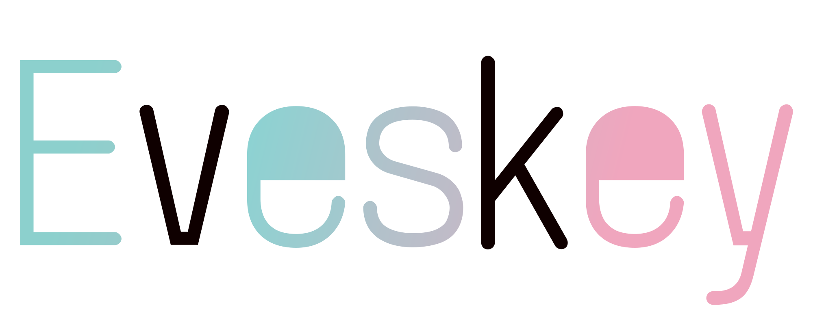

# Evesskey Logo Set

## Rights
> このロゴセットに関する著作権（および著作者人格権）を放棄します。
> 煮るなり焼くなり、勝手に配るなり、ご自由にどうぞ。
> 
- **CC0 (Public Domain)** 相当として扱ってください。
- 改変して再配布する場合も、同様に著作権を放棄（またはCC0を適用）した状態で公開してください。

## Files

### フォルダー構成
| Folder Name | Image | What For |
| :--- | :--- | :--- |
| [full](./full/) |  | 文字+アイコンのフル画像 |
| [icon-only](./icon-only/) |  | アイコンのみの画像 |
| [text-only](./text-only/) |  | 文字のみの画像 |

### ファイル構成
| File Name       | What For                       |
| --------------- | ------------------------------ |
| eveskey-ink.svg | Inkscape(編集ソフト)のファイル |
| eveskey.svg     | SVGファイル                    |
| eveskey.webp    | WebPファイル                   |
| eveskey.png     | PNGファイル                    |

## Version
v3.2

## Change log
v1.1 ./icon-only/evex-ink.svgの作成。
v2.1 icon-only全体の作成。
v3.1 full/text-onlyの追加。README.md整備
v3.2 README.mdの整備。改変前提に書き換える。README.mdのみ変更。

## Thanks
- Povo43(https://pf.kotoca.net)

改変して再配布する場合は追記してください。